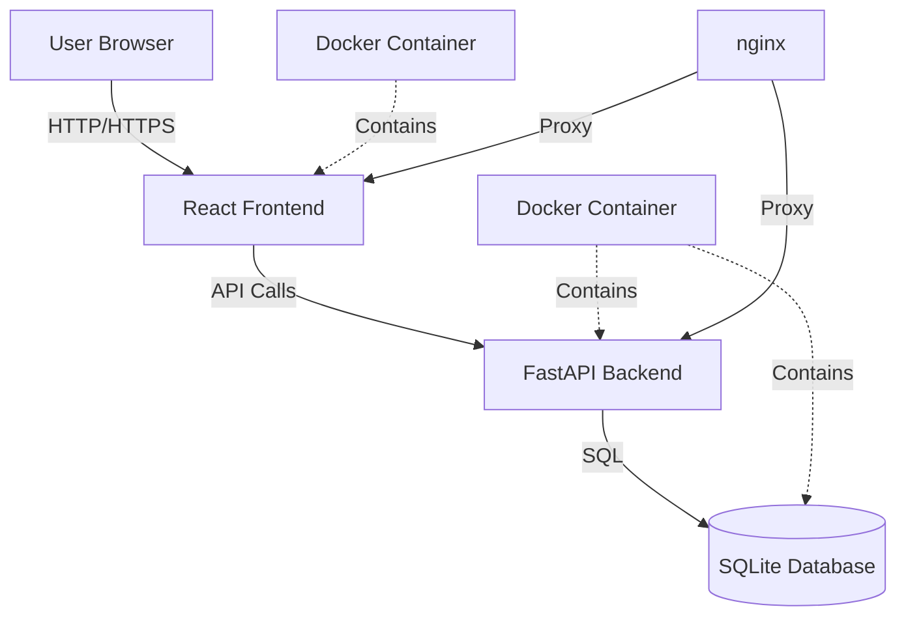
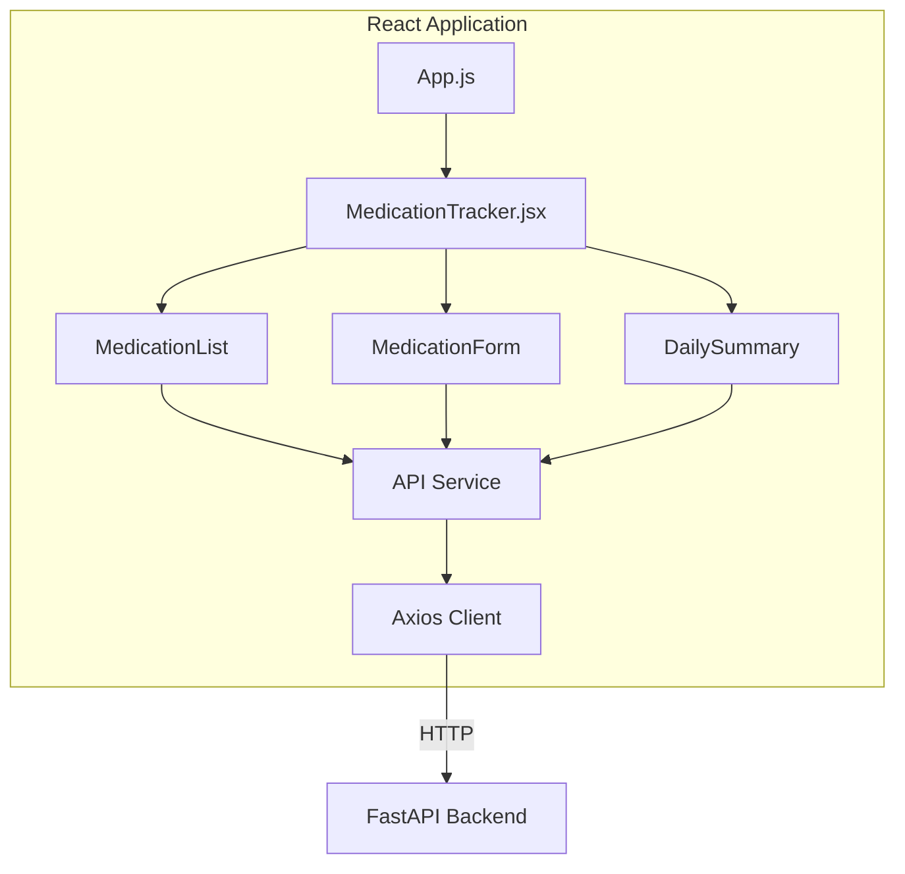
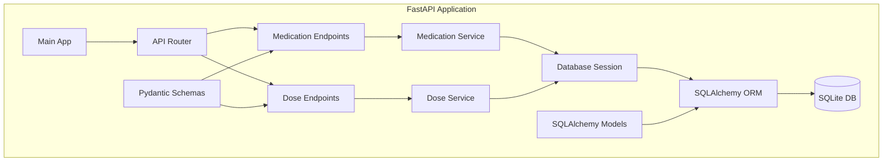
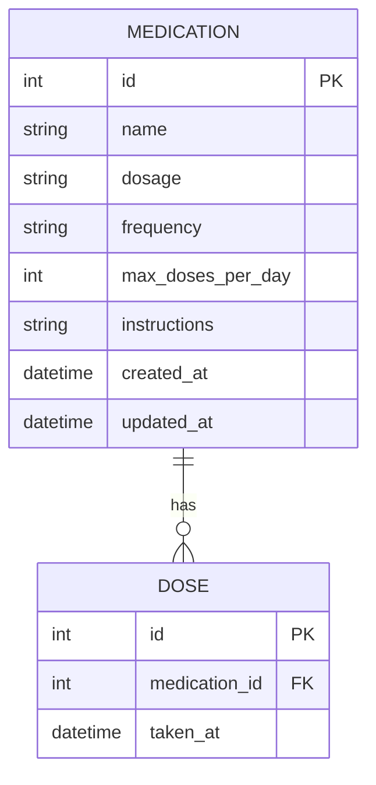
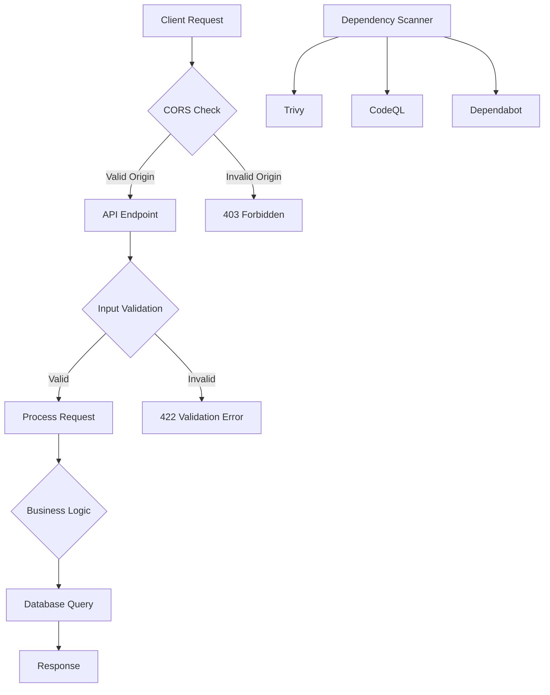
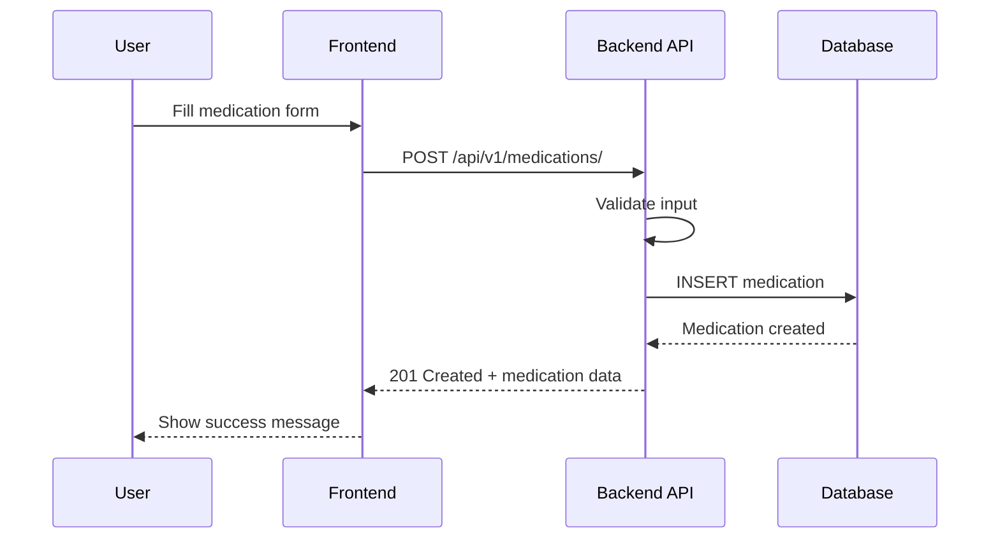
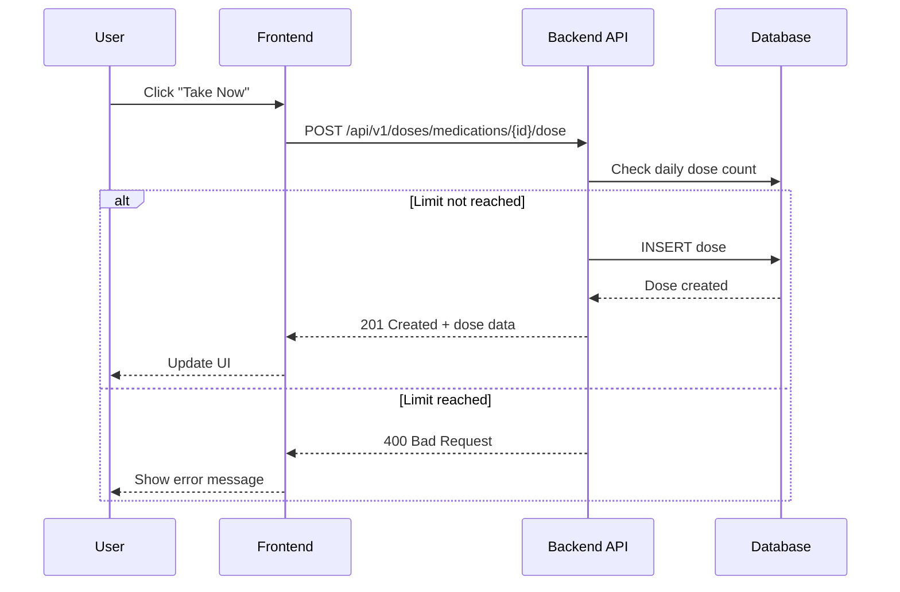
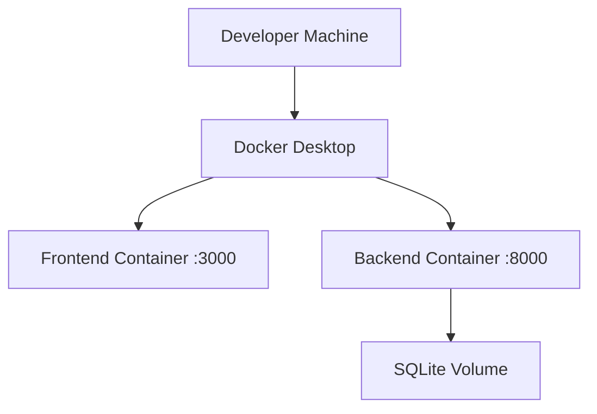
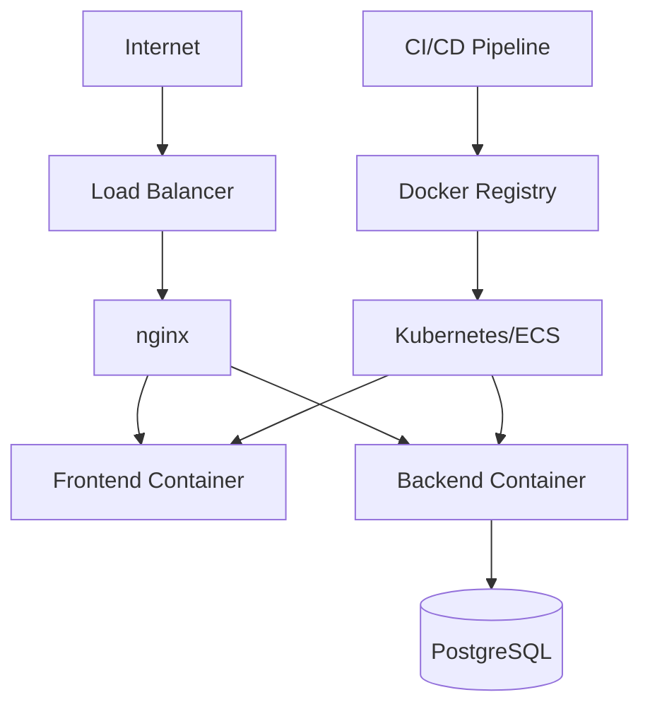

# MediTrack Architecture

## Overview

MediTrack follows a modern web application architecture with a clear separation between frontend and backend components. The system is designed for scalability, maintainability, and ease of deployment.

## High-Level Architecture



## Component Architecture

### Frontend Architecture



### Backend Architecture



## Database Schema



## Technology Stack

### Frontend
- **React 18**: UI framework
- **Axios**: HTTP client
- **React Testing Library**: Testing
- **CSS**: Styling (no framework currently)

### Backend
- **FastAPI**: Web framework
- **SQLAlchemy**: ORM
- **Pydantic**: Data validation
- **Alembic**: Database migrations
- **pytest**: Testing framework

### Infrastructure
- **Docker**: Containerization
- **Docker Compose**: Multi-container orchestration
- **nginx**: Reverse proxy (production)
- **GitHub Actions**: CI/CD pipeline

### Database
- **SQLite**: Development and simple deployments
- **PostgreSQL**: Production (planned)

## API Design Principles

1. **RESTful Design**: Following REST conventions for resource URLs
2. **Consistent Response Format**: All responses follow a predictable structure
3. **Proper HTTP Status Codes**: Using appropriate status codes for different scenarios
4. **Validation**: Request validation using Pydantic schemas
5. **Error Handling**: Consistent error response format

## Security Architecture



## Data Flow

### Creating a Medication



### Recording a Dose



## Deployment Architecture

### Development Environment



### Production Environment



## Performance Considerations

1. **Database Indexing**: Primary keys are indexed by default
2. **Query Optimization**: Using SQLAlchemy's query builder for efficient queries
3. **Caching**: Currently no caching implemented, planned for future releases
4. **Pagination**: Implemented for list endpoints
5. **Connection Pooling**: SQLAlchemy manages connection pooling

## Monitoring and Logging

### Current Implementation
- Application logs to stdout
- Docker logs accessible via `docker logs`
- Error tracking through structured logging

### Planned Improvements
- Structured logging with JSON format
- Log aggregation service integration
- Performance monitoring (APM)
- Health check endpoints

## Scalability Strategy

1. **Horizontal Scaling**: Stateless API design allows multiple backend instances
2. **Database Scaling**: Migration path from SQLite to PostgreSQL
3. **Caching Layer**: Redis for frequently accessed data (planned)
4. **CDN**: Static asset delivery for frontend (planned)
5. **Message Queue**: For async operations (planned)

## Directory Structure

```
meditrack/
├── backend/
│   ├── app/
│   │   ├── api/            # API routes and endpoints
│   │   │   ├── __init__.py
│   │   │   ├── api.py      # Main API router
│   │   │   └── endpoints/  # Individual endpoint modules
│   │   ├── core/           # Core application configurations
│   │   │   ├── __init__.py
│   │   │   └── config.py   # Application settings
│   │   ├── db/             # Database configurations
│   │   │   ├── __init__.py
│   │   │   ├── base.py     # Base model declaration
│   │   │   └── session.py  # Database session management
│   │   ├── models/         # SQLAlchemy ORM models
│   │   │   ├── __init__.py
│   │   │   ├── medication.py
│   │   │   └── dose.py
│   │   ├── schemas/        # Pydantic validation schemas
│   │   │   ├── __init__.py
│   │   │   ├── medication.py
│   │   │   └── dose.py
│   │   ├── services/       # Business logic layer
│   │   │   └── __init__.py
│   │   └── main.py         # FastAPI application entry point
│   ├── alembic/            # Database migration files
│   ├── tests/              # Test files
│   ├── scripts/            # Utility scripts
│   ├── requirements.txt    # Python dependencies
│   └── Dockerfile          # Backend container definition
│
├── frontend/
│   ├── src/
│   │   ├── components/     # React components
│   │   │   └── MedicationTracker.jsx
│   │   ├── services/       # API service layer
│   │   │   └── api.js
│   │   ├── App.js          # Main React application
│   │   ├── App.css         # Application styles
│   │   └── index.js        # React entry point
│   ├── public/             # Static assets
│   ├── package.json        # Node dependencies
│   └── Dockerfile          # Frontend container definition
│
├── .github/
│   └── workflows/          # CI/CD pipeline definitions
│       ├── ci.yml
│       └── security.yml
│
├── docs/                   # Documentation
├── docker-compose.simple.yml  # SQLite deployment configuration
├── docker-compose.postgres.yml # PostgreSQL deployment configuration
└── README.md              # Project overview
```

## Development Workflow

1. **Local Development**: Use Docker Compose for consistent environment
2. **Testing**: Automated tests run on every commit
3. **Code Review**: All changes go through pull request review
4. **CI/CD**: Automated testing and deployment via GitHub Actions
5. **Monitoring**: Application and infrastructure monitoring

## Future Architecture Improvements

1. **Authentication & Authorization**: JWT-based auth system
2. **Microservices**: Split into smaller services as needed
3. **Event-Driven Architecture**: For real-time updates
4. **GraphQL API**: Alternative to REST for complex queries
5. **Mobile Apps**: Native iOS/Android applications
6. **Multi-tenancy**: Support for multiple users/organizations